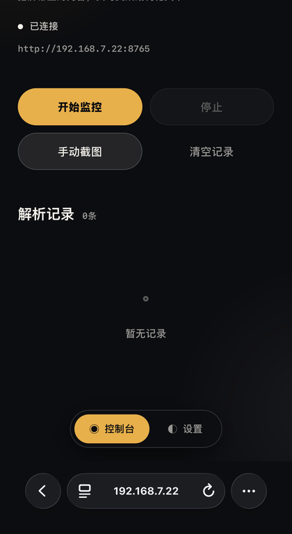
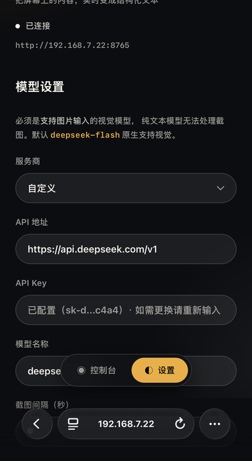
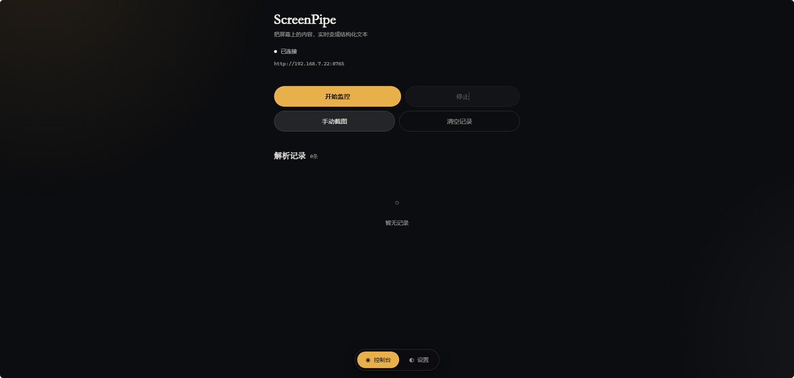
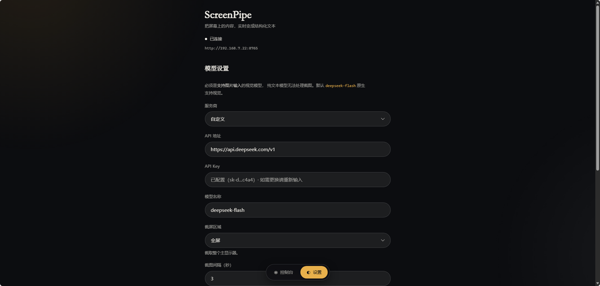
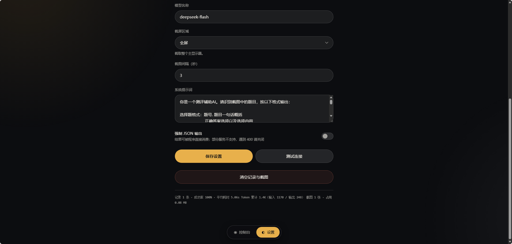

# ScreenPipe

**把屏幕上的内容，实时变成结构化文本。**

一条轻量管道：屏幕捕获 → 像素级变更检测 → 视觉模型理解 → WebSocket 实时推送。

[](https://www.python.org/)
[](https://fastapi.tiangolo.com/)
[](LICENSE)
[](tests/)

<p align="center">
  
  
</p>

<p align="center">
  <sub>左：手机端控制台 &nbsp;·&nbsp; 右：手机端设置页</sub>
</p>

## 功能

| 能力 | 说明 |
| --- | --- |
| 自动截屏识别 | 按间隔自动截图，**画面无变化时跳过模型调用**（省 Token 的关键） |
| 手机实时同步 | WebSocket 推送到手机浏览器，电脑在做什么手机就能看到 |
| 记录持久化 | SQLite 落盘，重启后仍能翻看；**失败也留痕**，便于排查 Key 过期 |
| 截图与记录绑定 | 点开缩略图即可核对「模型当时看到的是什么」 |
| 自动清理 | 截图按**天数 + 张数**双阈值回收，不让磁盘无限增长 |
| 区域预设 | `left_half` / `right_half` / `center`，只截目标区域省Token 也降噪 |
| 成本可见 | 每条记录带**耗时、Token 用量、图片体积**，可归因到单次请求 |
| markdown 渲染 | 表格、列表、代码块正常显示（手写实现，无 CDN 依赖） |
| JSON 输出模式 | 结果可被程序直接消费，而不只是给人阅读 |
| 配置热更新 | 网页端改配置立即生效，密钥不回显明文 |
| 视觉能力提醒 | 检测到模型未识图时主动告警，避免误用纯文本模型 |

## 界面

**电脑端 · 控制台**



**电脑端 · 设置**



<p align="center">
  
</p>

<p align="center"><sub>设置页底部 —— 强制 JSON 开关、成本统计与清空操作</sub></p>

---


---

## 为什么做这个

屏幕上有很多**只有看一眼才知道内容**的东西：网课老师的板书、监控看板上的数字、
后台表格里的一行数据、纸质票据上的金额。这些内容不复制粘贴出来，就只能靠人眼读。

现有的两种做法都不好用：

| 做法 | 问题 |
| --- | --- |
| 手动截图 → 上传给模型 | 打断节奏，一张图一次请求，成本高 |
| 定时截图 → 每次都问模型 | 屏幕没变也在烧 Token，慢且贵 |

ScreenPipe 的做法是**只在画面真的变了时才调模型**，并把结果推送到手机。

## 它能做什么

核心是一套管道，场景取决于你怎么写`system_prompt`：

- **在线课程笔记** —— 板书和PPT 自动转成结构化要点
- **监控看板读数** —— 大屏上的异常数字自动提取并告警
- **UI 回归检查** —— 界面变化时自动抓取并对比
- **表单 / 票据结构化** —— 纸质或截图里的字段转JSON
- **数据核对** —— 两个窗口的内容差异比对

> 内置提示词原本是为"解题"场景写的（刷题、网课练习），
> 这只是一个 case study —— 技术内核与场景无关，改 `system_prompt` 即可切换。

## 核心设计

### 1. 像素级变更检测（省Token 的关键）

屏幕静止时反复请求视觉模型是纯浪费。本模块用 `blake2b` 对像素数据取指纹，
画面没变就直接跳过模型调用。

```python
#为什么不用内置 hash()
#   1. hash() 对 bytes 会被 PYTHONHASHSEED 随机化 —— 进程重启后
#      同一画面得到的值不同，第一帧永远被判定为"已变化"
#   2. 桶数小，理论上存在碰撞
# blake2b 跨进程稳定，对小内存依然快
current = hashlib.blake2b(raw_pixels, digest_size=16).hexdigest()
if current == self._last_hash:
    return b""# 跳过模型调用
```

效果：连续观看同一个页面 10 分钟，可能只触发 1~2 次模型调用。

### 2. 记录与截图绑定，而不是各存各的

早期版本截图每轮落盘、记录只存文本，两者没有任何关联字段 ——
结果是磁盘上堆了几百张图（实测 33MB）却**既不能展示、也无法随记录一起删除**，
纯浪费空间。

现在 `capture.grab()` 返回一个 `Screenshot` 对象，把图片数据、文件名、
尺寸、体积放在一起；记录里的 `screenshot` 字段保存文件名：

```python
shot = capture.grab(save_to_disk=True)     # 拿到 data + filename + size_kb
record = {
    "screenshot": shot.filename,             # 与磁盘文件绑定
    "size_kb": shot.size_kb,                 # 成本可归因
    "elapsed": 6.21,                         # 耗时可归因
    "ok": True,                              # 失败也留痕
}
```

带来的能力：界面上点开缩略图即可核对「模型当时看到的是什么」；
清空记录时连同截图一起删，不留孤儿文件。

### 3. 磁盘不会无限增长

`RetentionPolicy` 用**双阈值**清理 —— 只按天数则高频运行时单日文件数依然
可能很大；只按张数则低频运行时占用会持续数月不回。

```python
policy = RetentionPolicy("screenshots", max_days=7, max_files=500)
removed, freed = policy.purge()   # 任一阈值超出即从最旧开始删
```

只匹配 `screenshot_*.jpg`，不会误删你放在同目录的其他文件。

### 4. 记录持久化：标准库 sqlite3

选它而不是 JSON 文件或引入 ORM：

- **零新依赖** —— `sqlite3` 是标准库，保持「无构建、开箱即跑」
- 单文件、零服务，按时间倒序取 N 条就是一条 SQL
- 内存里仍保留一份 `deque` 作热缓存，读路径不受磁盘 IO 影响

冷启动时回填到内存，所以**重启后仍能翻看之前的记录**。

失败也会落库（`ok=0` + `error` 类型）。像 Key 过期这种问题此前只弹一次
toast 就消失，现在能在历史里回看「昨天失败的都是 401」。

### 5. 区域预设：省Token 也降噪

全屏截图 1920×1080 约 188KB，而多数场景只关心屏幕上的一半。
预设由程序按当前分辨率**实时计算**坐标，用户无需手填：

| 预设 | 适用 |
| --- | --- |
| `full` | 主显示器全屏（默认） |
| `left_half` | 「左文档 / 右 AI」的并排布局 |
| `right_half` | 右半屏 |
| `center` | 居中 1200×800，聚焦对话内容 |

换区域会重置像素指纹 —— 否则首帧会被误判为「内容未变化」而跳过识别。

### 6. 密钥永不出进程

服务监听 `0.0.0.0` 供手机访问，且**不内置认证** —— 所以密钥泄露是真实风险。
`config.py` 因此把输出分成两个出口：

```python
cfg.to_dict()# 含明文，仅限进程内部
cfg.to_public_dict()        # api_key 掩码为 sk-a...wxyz，唯一允许走 HTTP 的出口
```

配套的前端逻辑：密钥输入框**不回填**明文，留空表示"沿用已保存的密钥"；
后端收到掩码形态的 Key 会直接忽略，避免把真密钥覆盖成一串乱码。

同理，`/api/screenshot/{name}` 是唯一能读到磁盘的入口，
做了路径穿越校验（只接受纯文件名 + 解析后二次确认仍在截图目录内）。

### 7. 单一模型抽象

任何 OpenAI 兼容且支持图片输入的服务都能接入，换模型只改配置不改代码。
MiniMax 的 VLM 走独立端点，客户端会自动识别域名并切换协议。

### 8. 手动触发强制截图

自动模式靠变更检测省Token，但代价是"题没变就什么都拿不到"。
因此手动触发会先 `reset_hash()`，保证每次点击都有结果。

## 快速开始

### Windows：双击 `start.bat`

无需命令行。脚本会自动完成：校验 Python → 创建虚拟环境 → 安装依赖 →
生成配置文件 → 启动服务。已完成的步骤在后续启动会自动跳过。

> `start.bat` 能绕过 Microsoft Store 的 0 字节 Python 占位程序 ——
> 这是 Windows 上最常见的"明明装了 Python 却说找不到"的原因。

### 任意平台：手动运行

```bash
python -m venv .venv
# Windows: .venv\Scripts\activate
# macOS/Linux: source .venv/bin/activate

pip install -r requirements.txt
cp config.example.yaml config.yaml# 填入你的 API Key
python main.py
```

启动后终端会打印手机可访问的地址（端口被占用时自动避让）：

```text
==============================================
  ScreenPipe 已启动: http://192.168.1.100:8765
  手机需与电脑处于同一局域网，按 Ctrl+C 停止
==============================================
```

手机浏览器打开该地址即可。

## 选择视觉模型

**必须是支持图片输入的视觉（多模态）模型** —— 纯文本模型无法处理截图。

| 服务商 | 模型 | `api_base` | 备注 |
| --- | --- | --- | --- |
| DeepSeek | `deepseek-flash` | `https://api.deepseek.com/v1` | **默认值**，上下文 1M |
| 智谱 | `glm-4.6v-flash` | `https://open.bigmodel.cn/api/paas/v4` | 免费档 |
| 阿里百炼 | `qwen3-vl-flash` | `https://dashscope.aliyuncs.com/compatible-mode/v1` | 新用户限免 |
| Ollama 本地 | `qwen3-vl:8b` | `http://localhost:11434/v1` | **图片不出本机** |
| 智谱 | `glm-4.6v` | 同上 | 付费，中文 OCR 较强 |
| 阿里百炼 | `qwen3-vl-plus` | 同上 | 付费，综合能力强 |
| 火山方舟 | `doubao-seed-2-0-lite` | `https://ark.cn-beijing.volces.com/api/v3` | 付费 |
| Moonshot | `kimi-k2.6` | `https://api.moonshot.cn/v1` | 付费 |
| MiniMax | Token Plan VLM | `https://api.minimax.chat/v1` | 走专用端点，自动适配 |

模型名随厂商快速迭代，**以上核实于 2026-10**；若返回 `model not found`，
请以对应厂商官方文档为准。网页端「设置」里内置了这些预设，选择即自动填入。

<details>
<summary>DeepSeek 的视觉能力与模型名沿革</summary>

`deepseek-flash` 是 DeepSeek API 当前的模型名，实际对应 **DeepSeek-V4.1-Flash**，
**原生支持图片输入**（JPEG / PNG / GIF / WebP，单图最多 1024 tokens），
上下文 1M，最大输出 384K。

几个容易踩坑的历史名称：

| 名称 | 状态 |
| --- | --- |
| `deepseek-flash` | ✅ 现役，视觉可用 |
| `deepseek-v4-pro` | ⚠️ 纯文本，**不支持**图片输入 |
| `deepseek-v4-flash` | 已退役，请求由 V4.1-Flash 承接 |
| `deepseek-v4-flash-vision-exp` | 2026-09-10 退役，能力并入 `deepseek-flash` |

旧名仍被接受且按 Flash 价计费，但新接入请直接用 `deepseek-flash`。

图片以 `data:image/jpeg;base64,...` 内联传入（本项目即采用这种方式），
**只能出现在 user 消息中**，放进 system 或 assistant 会返回 400。
</details>

## 配置

全部配置项见 `config.example.yaml`。

| 配置项 | 说明 | 默认值 |
| --- | --- | --- |
| `capture.interval` | 自动截图间隔（秒） | `10` |
| `capture.quality` | JPEG 质量（1-95），越低体积越小 | `60` |
| `capture.region` | 截屏区域 `[left, top, width, height]` | 全屏 |
| `capture.save_dir` | 截图落盘目录，留空用 `screenshots/` | `screenshots/` |
| `capture.region_preset` | 区域预设 `full`/`left_half`/`right_half`/`center` | `full` |
| `history.max_records` | 保留的记录条数（内存与数据库同此上限） | `200` |
| `retention.max_days` | 截图保留天数，超出自动清理 | `7` |
| `retention.max_files` | 截图保留张数，超出自动清理 | `500` |
| `storage.db_path` | SQLite 路径，留空用 `records.db` | `records.db` |
| `llm.api_base` | OpenAI 兼容地址，程序会拼接 `/chat/completions` | DeepSeek |
| `llm.api_key` | 密钥（`config.yaml` 已被 gitignore） | 占位符 |
| `llm.model` | **必须是视觉模型** | `deepseek-flash` |
| `llm.system_prompt` | 留空则用内置提示词 | 内置 |
| `llm.json_mode` | 强制 JSON 输出（部分服务不支持，遇 400 请关） | `false` |
| `server.host` | 监听地址，手机访问需保持 `0.0.0.0` | `0.0.0.0` |
| `server.port` | 监听端口，被占用时自动向后探测 | `8765` |

配置可在网页端热更新，改完立即生效。

## 项目结构

```text
.
├── main.py                    # 入口（含Windows 终端编码兜底）
├── config.py                  # 配置读写 + 密钥脱敏
├── capture.py                 # 屏幕捕获 + 像素指纹 + 区域预设 + 保留策略
├── llm_client.py              # 视觉模型客户端（OpenAI 兼容 + MiniMax）
├── store.py                   # SQLite 记录持久化（标准库，零新依赖）
├── launcher.py                # 一键启动器实现（由 start.bat 调用）
├── start.bat                  # Windows 唯一启动入口
├── pyproject.toml             # 包元数据与依赖声明
├── config.example.yaml        # 配置模板
├── requirements.txt           # 依赖清单
├── docs/screenshots/           # README 用的界面截图
├── records.db                 # 运行时生成（已 gitignore）
├── server/
│   ├── app.py                 # FastAPI 服务：REST + WebSocket 编排
│   └── templates/index.html   # 移动端界面（单文件，无构建步骤）
└── tests/                     # 108 个单元 / 集成测试
```

职责边界：`capture.py` 管怎么截屏、`llm_client.py` 管怎么调模型、
`store.py` 管怎么存、`server/app.py` 只做编排与对外暴露 ——
`app.py` 里没有任何 SQL 与文件删除细节。

## 开发

```bash
pip install -e ".[dev]"
pytest                    # 108 个用例
pytest --cov              # 覆盖率
```

测试覆盖了几处容易回归的地方：密钥脱敏、掩码回显保护、响应结构兼容、
有界历史淘汰、端口避让、**前后端端点契约**、截图保留策略、SQLite 往返与重启回填。

其中一条值得单独说：`test_front_end_referenced_endpoints_all_exist`
用正则抓出页面里所有 `fetch('/api/...')` 调用，与服务端实际路由比对。
它来自一次真实事故 —— 重写 `server/app.py` 时漏掉了 `/api/ip` 端点，
页面一直显示「地址获取失败」，而当时所有测试都是绿的。

## 已知限制

- **仅 Windows**：截屏依赖 `mss`，`start.bat` 也是 Windows 专用；
  Python 代码本身跨平台，但入口脚本没有做 macOS / Linux 适配
- **服务无认证**：默认监听 `0.0.0.0`，同网段 anyone 都能访问。
  **请勿直接暴露到公网**；需要远程访问请自行加反向代理 + TLS + 访问控制
- **历史与截图同目录**：清空记录会一并删除截图，暂不支持只删记录保留图片
- **`system_prompt` 需按场景改**：内置提示词偏"解题"，
  换场景时记得改，否则模型会按题目格式输出

## 常见问题

**Q：模型回复"没有收到图片"？**
说明当前模型不支持图片输入。换一个视觉模型，或点「设置 → 测试连接」确认。

**Q：提示端口被占用？**
程序会自动向后探测并打印实际端口，以打印的地址为准。也可在
`config.yaml` 里手动指定 `server.port`。

**Q：手机打不开页面？**
确认手机与电脑同一局域网、电脑防火墙放行该端口、`server.host` 为 `0.0.0.0`。

**Q：自动截屏不触发？**
画面无变化时会跳过，这是省 Token 的正常行为。点「手动截图」强制触发一次。

**Q：`start.bat` 提示找不到 Python？**
若 `python --version` 没有任何输出，是 Microsoft Store 的占位程序在拦截。
关掉它：设置 → 应用 → 高级应用设置 → 应用执行别名 → 禁用 `python.exe`。

## License

[MIT](LICENSE)
